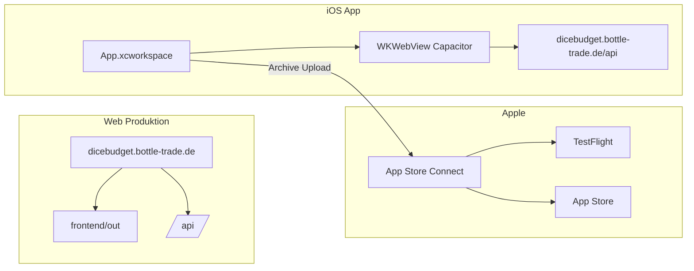

# GOiOS — dice.budget im Apple App Store

Leitfaden für **iOS (Capacitor)**, **TestFlight** und **App Store** — ergänzt [milestones.md](./milestones.md) (Milestone 21) und die Web-App unter [README.md](./README.md).

**Stand:** Mai 2026  
**Nutzer:** Marc Langebeck · Apple Developer Program aktiv

---

## 0. Aktueller Stand (2026-05-28, verbindlich)

- TestFlight-Uploads laufen bis Build `1.0 (9)` erfolgreich.
- Frueherer Xcode-Uploadfehler (`Copy failed`/`rsync`) war ein lokaler Mac-PATH-Konflikt (Homebrew-`rsync` statt `/usr/bin/rsync`).
- Datenschutz-Umbau (Milestone 22) ist ausgerollt.
- Aktueller Blocker liegt in der iOS-UI-Abnahme (nicht im Upload):
  - Legal-Links (`Datenschutz`/`Impressum`) auf dem Auswahlscreen `/app` laut Nutzer nicht sichtbar.
  - `Startseite`-Button oben entspricht laut Nutzer nicht der Zieloptik/-konsistenz.
  - Icon-Optik auf dem Auswahlscreen entspricht laut Nutzer nicht der Erwartung.

Diese Punkte gelten als offene Folgearbeit in Milestones 23, 26 und 27.

---

## 1. Zielbild

| Ebene | URL / Ort | Status |
|-------|-----------|--------|
| **Web (Produktion)** | https://dicebudget.bottle-trade.de | Live |
| **API** | https://dicebudget.bottle-trade.de/api | Live |
| **Datenschutz** | https://dicebudget.bottle-trade.de/datenschutz | Live |
| **GitHub** | https://github.com/marclangebeck/dicebudget | Code gepusht |
| **iOS (Capacitor)** | `frontend/ios/` | Im Repo, Simulator OK (Mac) |
| **App Store Connect** | App **dice.budget**, Bundle `de.bottletrade.dicebudget` | In Einrichtung |
| **Store-Preis (Ziel)** | **1,19 €** (kostenpflichtige App) | Ausstehend (Paid-Vertrag + Preisstufe) |

**Wichtig:** Web und iOS teilen **dieselbe Codebasis** (`frontend/`). Web-Deploy ändert **nicht** automatisch die iOS-App — nach UI-Änderungen: `npm run build:ios` → erneut Archive auf dem Mac.

---

## 2. Architektur iOS vs. Web



| | Browser | iOS-App |
|---|---------|---------|
| Start-URL | `/` Landing | direkt `/app` (`NativeAppEntry`) |
| API | `/api` (same-origin) | `https://dicebudget.bottle-trade.de/api` (`lib/apiBase.ts`) |
| Bundle / App-ID | — | `de.bottletrade.dicebudget` |

**Nicht verwenden:** alte App Store Connect-Eintrag **mobile-app** mit `com.mlangebeck.mobileapp` — gehört **nicht** zu diesem Xcode-Projekt.

---

## 3. Meilensteine (Überblick)

### Bereits erledigt (Web + Backend, M1–M20)

Diese Milestones sind **Voraussetzung** für eine sinnvolle iOS-App; Details in [milestones.md](./milestones.md).

| Block | Inhalt |
|-------|--------|
| M1–M6 | Backend, Frontend, Scoring, Pool, Abschluss |
| M7–M10 | Statistik (Basis), Multiplayer, Rangliste |
| M11–M14 | Modi, PWA, Validierung, `npm test` (Backend) |
| M15–M19 | Liga, Paarungsstatistik, Namen, Feld löschen, Zusatz-Yatzy |
| M20 | UI: Bento, Statistik, Setup, Spielzettel ohne Seiten-Scroll |

### Milestone 21 — iOS (dieser Leitfaden)

| # | Thema | Status | Wo / Hinweis |
|---|--------|--------|----------------|
| 21.1 | Capacitor 7, `frontend/ios/` | **erledigt** | `capacitor.config.ts` |
| 21.2 | Bundle ID `de.bottletrade.dicebudget` in Xcode | **erledigt** | `project.pbxproj` |
| 21.3 | App-ID im Developer Portal | **erledigt** | Description z. B. `DiceBudget` (ohne Punkt) |
| 21.4 | Native API-URL, Start `/app` | **erledigt** | `apiBase.ts`, `NativeAppEntry.tsx` |
| 21.5 | Doku Xcode / TestFlight | **erledigt** | `docs/ios-xcode-anleitung.md`, `docs/testflight-app-store.md` |
| 21.6 | GitHub-Repo `marclangebeck/dicebudget` | **erledigt** | Clone auf Mac für Xcode |
| 21.7 | Mac: Node, CocoaPods, Xcode, Simulator | **erledigt** | Nutzer bestätigt: App läuft im Simulator |
| 21.8 | App Store Connect: **neue** App dice.budget | **in Arbeit** | Vollzugriff; Bundle `de.bottletrade.dicebudget` |
| 21.9 | Geschäftliches: Lizenz, EU-Händler, **Paid-Vertrag**, Bank/Steuer | **offen** | Für **1,19 €** nötig |
| 21.10 | Preisstufe **1,19 €** in Connect | **offen** | Tab App Store → Preis und Verfügbarkeit |
| 21.11 | App-Icon 1024, Screenshots, Beschreibung DE | **offen** | Store-Metadaten |
| 21.12 | Xcode: Archive → Upload | **erledigt** | Build `1.0 (9)` in TestFlight verarbeitet |
| 21.13 | TestFlight (intern + iPhone) | **in Arbeit** | Build verfuegbar; UI-Abnahme offen |
| 21.14 | App Store Review (kostenpflichtig) | **offen** | Nach stabiler Beta |

---

## 4. Prozess (End-to-End)

### Phase A — Voraussetzungen (einmalig)

| Schritt | Aktion | Status |
|---------|--------|--------|
| A1 | Apple Developer Program (99 €/Jahr) | erledigt |
| A2 | Mac mit **Xcode** (App Store), nicht nur Command Line Tools | erledigt |
| A3 | `xcode-select -s /Applications/Xcode.app/Contents/Developer` | erledigt |
| A4 | Node.js LTS, `pod install` in `frontend/ios/App` | erledigt |
| A5 | App-ID **App IDs** → `de.bottletrade.dicebudget` | erledigt |

### Phase B — Repository & Build (Mac)

```bash
git clone https://github.com/marclangebeck/dicebudget.git kniffel
cd kniffel/frontend
npm install
npm run build:ios          # next build + cap sync ios
open ios/App/App.xcworkspace   # immer .xcworkspace
```

Details: [docs/ios-xcode-anleitung.md](./docs/ios-xcode-anleitung.md)

### Phase C — App Store Connect

1. **Apps** → **+** → Neue App: **dice.budget**, Bundle **`de.bottletrade.dicebudget`**, **Vollzugriff**
2. **Geschäftliches:** Developer-Lizenz akzeptieren, EU-Händler (DSA), **Vertrag kostenpflichtige Apps** + Bank + Steuer
3. **App-Datenschutz:** URL `https://dicebudget.bottle-trade.de/datenschutz` + Fragebogen (kein Tracking)
4. **App Store** (Version 1.0): Preis **kostenpflichtig** (~1,19 €), Screenshots, Texte, Kategorie Spiele

Details: [docs/testflight-app-store.md](./docs/testflight-app-store.md)

### Phase D — Release

1. Xcode: **Any iOS Device** → **Product → Archive**
2. **Distribute App** → **App Store Connect** → **Upload**
3. **TestFlight** → interne Tester → iPhone-Test
4. **Zur Überprüfung einreichen** (öffentlicher Store)

### Phase E — Wartung nach Code-Änderungen

```bash
git pull
cd frontend && npm run build:ios
# Build-Nummer in Xcode erhöhen → Archive → Upload
```

Web separat: `sudo bash infra/scripts/deploy-frontend-prod.sh` (Server).

---

## 5. Referenzwerte (Copy-Paste)

| Feld | Wert |
|------|------|
| Anzeigename | dice.budget |
| Bundle ID | `de.bottletrade.dicebudget` |
| Capacitor `appId` | `de.bottletrade.dicebudget` |
| Version / Build (Start) | 1.0 / 1 |
| Datenschutz-URL | https://dicebudget.bottle-trade.de/datenschutz |
| Support-URL | https://dicebudget.bottle-trade.de |
| GitHub | https://github.com/marclangebeck/dicebudget |
| Xcode-Workspace | `frontend/ios/App/App.xcworkspace` |

---

## 6. Bekannte Stolpersteine

| Problem | Lösung |
|---------|--------|
| App Store Connect ohne Kachel **Apps** | **Geschäftliches** → Verträge + Lizenz |
| Nur „Vertrag kostenlose Apps“ | **Paid Applications** + Bank/Steuer |
| `xcodebuild` / Command Line Tools | Volles Xcode, `xcode-select` setzen |
| CocoaPods fehlt | `sudo gem install cocoapods`, `pod install` |
| Leeres Xcode-Fenster | `App.xcworkspace` öffnen, nicht `.xcodeproj` |
| Bundle-ID mismatch | Connect **de.bottletrade.dicebudget** = Xcode; nicht `com.mlangebeck.mobileapp` |
| App-ID Description mit Punkt | Nur alphanumerisch: z. B. `DiceBudget` |
| Gelbe Xcode-Warnungen (WKProcessPool, Pods) | Meist ignorierbar, Build trotzdem möglich |
| `Copy failed` / `rsync error` beim Distribute | Xcode aus Shell mit System-PATH starten: `export PATH="/usr/bin:/bin:/usr/sbin:/sbin"` und danach Xcode neu öffnen |
| Push vom Server | SSH-Key `github_dicebudget` oder HTTPS-Token |

---

## 7. Dokumentation im Repo

| Datei | Inhalt |
|-------|--------|
| [GOiOS.md](./GOiOS.md) | Dieser Leitfaden + Agent-Prompt |
| [docs/ios-xcode-anleitung.md](./docs/ios-xcode-anleitung.md) | Xcode Einsteiger |
| [docs/testflight-app-store.md](./docs/testflight-app-store.md) | Connect, Archive, TestFlight, Review |
| [docs/ios-app-store.md](./docs/ios-app-store.md) | Kurzreferenz Capacitor |
| [docs/github-setup.md](./docs/github-setup.md) | Git / Push |
| [HANDOVER.md](./HANDOVER.md) | Gesamtprojekt Web + Backend |
| [milestones.md](./milestones.md) | M1–M21 |

---

## 8. Noch nicht geplant (nach iOS-Release)

- In-App-Käufe (nur **App-Preis** 1,19 € geplant, kein IAP)
- Push-Benachrichtigungen
- Android / Play Store
- Next.js Security-Upgrade (CVE-Hinweis bei `next@15.5.4`)

---

# Prompt für neuen Agent (iOS & Store)

**Kopiere ab hier bis „Ende Prompt“ in einen neuen Cursor-Chat.**

---

Du setzt **Milestone 21 (iOS / App Store)** für **dice.budget** fort. Lies zuerst:

1. **[AGENT_RULES.md](./AGENT_RULES.md)** — kein Dauer-`npm run dev` auf dem Server, keine Polling-Loops  
2. **[GOiOS.md](./GOiOS.md)** (dieses Dokument, Abschnitte 1–7)  
3. Bei Bedarf: [docs/testflight-app-store.md](./docs/testflight-app-store.md), [HANDOVER.md](./HANDOVER.md)

**Antworten auf Deutsch.** Keine Commits, es sei denn, der Nutzer verlangt es explizit.

### Projektkontext

- **Repo:** `/home/bottleadmin/projects/kniffel` (Server) · GitHub: `marclangebeck/dicebudget`  
- **Produkt:** Strategisches Yatzy („dice.budget“), Web live unter **dicebudget.bottle-trade.de**  
- **iOS:** Capacitor-Wrapper um statischen Next-Export; **kein** Swift-UI-Neuaufbau  
- **Zielpreis App Store:** **1,19 €** (kostenpflichtige App, kein In-App-Kauf für den Start)

### Bereits erledigt (nicht neu bauen)

- Web M1–M20, API, Datenschutzseite, Domain ohne `kniffel` (geschützter Name)  
- Capacitor: `frontend/ios/`, Bundle **`de.bottletrade.dicebudget`**, `npm run build:ios`  
- Developer: App-ID registriert (Description ohne Punkt, z. B. `DiceBudget`)  
- Mac: Simulator zeigt Bento-Start, API/Statistik funktioniert  
- GitHub gepusht; alter Connect-Eintrag **`com.mlangebeck.mobileapp`** / **mobile-app** ignorieren

### Offene Punkte (deine Priorität)

1. **App Store Connect:** App **dice.budget** mit Bundle `de.bottletrade.dicebudget` fertig anlegen (Vollzugriff)  
2. **Geschäftliches:** Developer-Lizenz, EU-Händler-Compliance, **Paid Applications Agreement**, Bank, Steuer  
3. **Preis ~1,19 €**, Datenschutzfragebogen, Screenshots, Beschreibung DE  
4. Anleitung/Checkliste für Nutzer: **Archive → Upload → TestFlight → Review**  
5. Optional: `GOiOS.md` / Milestone 21 in `milestones.md` aktualisieren, wenn Schritte abgeschlossen sind

### Wichtige Pfade

```
frontend/capacitor.config.ts      # appId de.bottletrade.dicebudget
frontend/lib/apiBase.ts           # Capacitor → absolute API-URL
frontend/ios/App/App.xcworkspace  # Xcode öffnen
frontend/components/NativeAppEntry.tsx
```

### Regeln

- **Web-Deploy** (`deploy-frontend-prod.sh`) und **iOS-Release** sind getrennt; iOS braucht Mac/Xcode.  
- Nach Frontend-Änderungen: `npm run build:ios` auf dem Mac, Build-Nummer erhöhen, erneut uploaden.  
- Bundle-ID in Xcode und Connect müssen **identisch** sein: `de.bottletrade.dicebudget`.  
- Keine neue App unter `com.mlangebeck.mobileapp` mit dem aktuellen Xcode-Projekt verknüpfen.

### Nutzer-Kontext

- Xcode-Einsteiger — **kleine Schritte**, nach jedem Block Rückfrage („Phase X ok“).  
- Arbeitet auf **Mac** (Clone, Xcode) und **Server** (Deploy Web); SSH-Key `github_dicebudget` für GitHub Push vom Server.

### Bei Unsicherheit

- Frage den Nutzer nach Screenshot oder exakter Meldung aus App Store Connect / Xcode.  
- Kein Force-Push, keine git config-Änderungen, keine Produktions-Experimente ohne Freigabe.

**Ende Prompt**
