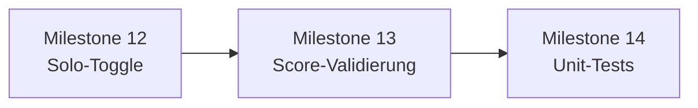

# Milestones – DiceBudget Strategy Edition

## Übersicht

| Block | Milestones | Status |
|-------|------------|--------|
| MVP | 1–10 | erledigt |
| UX & Modi | 11–14 | erledigt |
| Liga & Statistik | 15–19 | erledigt |
| UI-Modernisierung | 20 | erledigt |
| iOS (Capacitor) | 21 | in Arbeit |

*(Variante D „echtes Online-Spiel“ / Live-Sync bewusst nicht Teil dieser Milestones.)*

---

## Milestone 1: Basis-Projektstruktur

**Status:** erledigt

---

## Milestone 2: Datenmodell (Singleplayer)

- `game_count` 1–6, Run/Game/Field/Roll  
- Felder = `game_count × 13`, Max-Würfe (Strategy) = `game_count × 39`

**Status:** erledigt

---

## Milestone 3: Backend-API (Singleplayer)

- Runs, Complete, Finish, optional Rolls  
- Scoring, `rolls_in_pool`

**Status:** erledigt

---

## Milestone 4: Frontend-Grund-UI

- Setup, Play, Zettel, API-Client  
- Produktion: statischer Export + Nginx `/api`

**Status:** erledigt

---

## Milestone 5: Wurf-Pool-Mechanik

- Nur bei `useStrategyRules: true`  
- 1–3 Würfe → Rest in Pool; 4+ aus Pool; globales Limit `game_count × 39`

**Status:** erledigt (Strategy); Klassisch ohne Pool siehe Milestone 11

---

## Milestone 6: Scoring & Abschluss

- `computeGameBreakdown`, Zettel-Summen, `RunFinishScreen`  
- Overlay nach letztem Feld mit Gesamtpunktzahl (vor Finish-Screen)

**Status:** erledigt

---

## Milestone 7: Statistiken

- `GET /stats`  
- Startseite (heute Bento): **bester Gesamtscore** in der Statistik-Kachel; ausführliche Paarungsstatistik auf `/stats` (Milestone 16)

**Status:** erledigt (vereinfacht, später um Paarungen erweitert)

---

## Milestone 8: Multiplayer-Datenmodell & API

- `GameSession`, `Player`, `use_strategy_rules`  
- `/sessions`, Join, `X-Player-Secret`

**Status:** erledigt

---

## Milestone 9: Multiplayer-Frontend

- `/multi` Host, `/multi/join?code=…`, `/play`  
- Code auf Startseite, Resume-Banner

**Status:** erledigt

---

## Milestone 10: Rangliste & Gewinner

- `GET …/ranking`, Lobby-Tab, Finish-Links

**Status:** erledigt

---

## Milestone 11: UX, Modi & Produktionsreife (laufend)

Ziel:

- Zwei Spielmodi: **Strategy Edition** (Default) vs. **Klassisches Kniffel**
- Klare UI, PWA, sinnvoller Abschluss-Flow

Deliverables (Stand):

| Thema | Status |
|--------|--------|
| Toggle Raum erstellen (`useStrategyRules`) | erledigt |
| Backend-Regeln Klassisch (max. 3 Würfe/Feld, kein Pool) | erledigt |
| UI ohne Pool/Würfe bei Klassisch | erledigt |
| Overlay „X Punkte erzielt“ nach letztem Feld | erledigt |
| `abandon` Run | erledigt |
| Helles UI + Kontrast | erledigt (Feintuning möglich) |
| PWA Manifest/Icons | erledigt |
| Solo: gleicher Modus-Toggle | → **Milestone 12** |
| Server-Validierung Score pro Feldtyp | → **Milestone 13** |
| Tests (Unit) | → **Milestone 14** |

Akzeptanzkriterien (für Milestone 11 erfüllt):

- Host wählt Modus vor Raumerstellung; Gäste sehen Modus in Lobby
- Klassisch: keine Pool-Anzeige, kein Wurfzähler im Eintrag
- Strategy: unverändert zur Spezifikation in `projektbeschreibung.md`

**Status:** erledigt (offene Punkte in Milestones 12–14 ausgelagert)

---

## Milestone 12: Solo-Toggle Spielmodus

**Ziel:** Singleplayer kann vor Start dieselbe Moduswahl treffen wie der MP-Host — **Strategy Edition** (Default) oder **Klassisches Kniffel**.

**Abhängigkeiten:** Milestone 11 (MP-Toggle, Backend `POST /runs` mit `useStrategyRules`).

### Deliverables

| # | Aufgabe | Dateien (voraussichtlich) |
|---|---------|---------------------------|
| 12.1 | State `useStrategyRules` (Default `true`) in `GameSetup` | `frontend/components/GameSetup.tsx` |
| 12.2 | Wiederverwendung `StrategyModeToggle` (wie `/multi`) | `frontend/components/StrategyModeToggle.tsx` |
| 12.3 | `createRun(gameCount, useStrategyRules)` im API-Client | `frontend/lib/api.ts` |
| 12.4 | Hilfstexte abhängig vom Modus (Felder/Würfe nur bei Strategy) | `GameSetup.tsx` |
| 12.5 | Manueller Check: Solo Klassisch → kein Pool in `/play`; Solo Strategy unverändert | — |

### Akzeptanzkriterien

- [x] Toggle sichtbar auf der Startseite im Solo-Setup, **Standard: Strategy an**
- [x] `POST /runs` sendet `{ gameCount, useStrategyRules }` entsprechend der Wahl
- [x] Neuer Solo-Run verhält sich identisch zum MP-Run desselben Modus (Klassisch: `rollsUsed: 1`, kein Pool-UI)
- [x] Keine Regression bei MP (`/multi` unverändert funktionsfähig)

### Nicht im Scope

- Server-Validierung der Scores (Milestone 13)
- Automatisierte Tests (Milestone 14)
- Änderungen an Scoring- oder Pool-Regeln

### Geschätzter Aufwand

**Klein** (ca. 0,5–1 Tag) — API und UI-Komponente existieren bereits.

**Status:** erledigt (Mai 2026)

---

## Milestone 13: Server-Validierung Punktwerte

**Ziel:** `POST …/complete` akzeptiert nur Scores, die zum `fieldType` passen — unabhängig vom Client (Schutz vor manipulierten Requests, konsistent mit UI-Buttons).

**Abhängigkeiten:** Milestone 12 empfohlen (beide Modi manuell prüfbar), technisch unabhängig umsetzbar.

### Ausgangslage

- Frontend: `fieldScoreChoices()` in `frontend/lib/labels.ts` definiert erlaubte Werte pro Feldtyp
- Backend: `completeField()` prüft Rolls/Pool/Status, **nicht** ob `score` zum Feldtyp passt

### Deliverables

| # | Aufgabe | Dateien (voraussichtlich) |
|---|---------|---------------------------|
| 13.1 | Domain-Funktion `assertValidScoreForField(fieldType, score)` mit gleicher Logik wie UI | `backend/src/domain/fieldScores.ts` (neu) oder Port der Choice-Tabellen |
| 13.2 | Aufruf in `completeField()` vor Persistenz | `backend/src/services/playField.ts` |
| 13.3 | HTTP 400 + klare Fehlermeldung bei ungültigem Score | `backend/src/routes/…`, `errorHandler` |
| 13.4 | Optional: gemeinsame Konstanten dokumentieren (Frontend/Backend-Duplikat akzeptiert, kein Shared-Package nötig) | Kommentar in beiden Dateien |
| 13.5 | Manueller Negativtest: `curl` mit falschem `score` → 400 | — |

### Regeln (Referenz, identisch zu `labels.ts`)

| Feldgruppe | Erlaubte Scores |
|------------|-----------------|
| ONES … SIXES | `0`, `n×Augenzahl` für `n ∈ 1..5` |
| THREE_OF_A_KIND, FOUR_OF_A_KIND, CHANCE | `0..30` |
| FULL_HOUSE, SMALL_STRAIGHT, LARGE_STRAIGHT, KNIFFEL | feste Regelpunkte oder `0` (streichen) |

### Akzeptanzkriterien

- [x] Jeder gültige UI-Button-Wert wird vom Server akzeptiert (beide Modi)
- [x] Ungültige Werte (z. B. `7` bei ONES, `99` bei KNIFFEL) → **400**, Feld bleibt offen
- [x] Bestehende Pool-/Rolls-Validierung unverändert
- [x] Kein Schema-Migration nötig

### Nicht im Scope

- Validierung „passt der Score zu echten Würfeln“ (physikalische Kniffel-Logik) — nur **erlaubte Eintragsmenge**
- Frontend-Änderung außer ggf. Anzeige der Server-Fehlermeldung

### Geschätzter Aufwand

**Klein–mittel** (ca. 1 Tag inkl. manueller Checks).

**Status:** erledigt (Mai 2026)

---

## Milestone 14: Unit-Tests Kernlogik

**Ziel:** Automatisierte Regressionstests für Scoring und Spiellogik (Strategy vs. Klassisch), ohne E2E-Browser-Setup.

**Abhängigkeiten:** Milestone 13 abgeschlossen (Tests für Score-Validierung mit abdecken).

### Deliverables

| # | Aufgabe | Dateien (voraussichtlich) |
|---|---------|---------------------------|
| 14.1 | Test-Runner im Backend (z. B. **Node `node:test`** oder **Vitest** — eine Wahl, dokumentiert in README Backend) | `backend/package.json` |
| 14.2 | Tests `gameScoring`: Bonus 63/35, `gameTotal`, Summen über Spiele | `backend/src/domain/gameScoring.test.ts` |
| 14.3 | Tests `playField` / Hilfsfunktionen: Pool-Delta, Roll-Limits, Klassisch `rollsUsed === 1` | `backend/src/services/playField.test.ts` oder `domain/` |
| 14.4 | Tests `assertValidScoreForField` (Milestone 13) | `backend/src/domain/fieldScores.test.ts` |
| 14.5 | Script `npm test` im Backend; optional in CI-Vorbereitung dokumentiert | `backend/package.json`, Root-README kurz |
| 14.6 | Keine Dauerprozesse / keine Netzwerk-Tests gegen Prod-Domain (`AGENT_RULES.md`) | — |

### Akzeptanzkriterien

- [x] `cd backend && npm test` läuft lokal grün ohne laufende API
- [x] Mindestens je ein Testfall: Strategy-Pool (spare/cost), Klassisch ohne Pool, ungültiger Score abgewiesen
- [x] `gameScoring`-Randfälle: genau 63 oben → Bonus; unter 63 → kein Bonus
- [x] Tests nutzen In-Memory/Fixtures oder Prisma-Test-DB — **kein** Polling, **kein** paralleler Dev-Server nötig

### Nicht im Scope (v1)

- Playwright/Cypress E2E
- Frontend-Unit-Tests
- Load-Tests / Multiplayer-Sync-Tests

### Geschätzter Aufwand

**Mittel** (ca. 1–2 Tage, abhängig von Test-DB-Strategie für `playField`).

**Status:** erledigt (Mai 2026)

---

## Reihenfolge & Definition of Done (12–14)

| Milestone | DoD kurz |
|-----------|----------|
| **12** | Solo startet mit gewähltem Modus; MP unberührt |
| **13** | API lehnt illegale Scores ab; UI-Fehler optional sichtbar |
| **14** | `npm test` grün; Kernpfade Strategy/Klassisch abgedeckt |

Nach Abschluss von 14: `HANDOVER.md` und `CHANGELOG.md` aktualisieren; Deploy-Hinweis nur bei Schema-Änderung (hier nicht erwartet).

---

## Milestone 15: Serien & Ligapunkte

**Ziel:** Multiplayer-Runden zu einer **Serie** (`leagueCode`) bündeln; nach jeder abgeschlossenen Runde Siegpunkte und Differenz-Bonus fortschreiben.

### Deliverables

| Thema | Status |
|--------|--------|
| Prisma `League`, `LeagueStanding`, Session-Felder `leagueId`, `roundNumber`, `pointsAwarded` | erledigt |
| `computeRoundPoints`, `awardSessionLeaguePoints` | erledigt |
| Lobby: Serien-Rangliste, „Neue Runde in derselben Serie“ | erledigt |
| Tests `leaguePoints` | erledigt |

**Status:** erledigt (Mai 2026)

---

## Milestone 16: Paarungsstatistik

**Ziel:** Direktvergleich zweier Spieler über abgeschlossene MP-Runden; eigene Statistik-Seite.

### Deliverables

| Thema | Status |
|--------|--------|
| `GET /stats/pairings`, `GET /stats/pairing?key=` | erledigt |
| `/stats`, `/stats/pairing?key=…` (statischer Export) | erledigt |
| Button „Statistik“ auf Startseite | erledigt |
| Head-to-Head-Logik in `pairingStats.ts` | erledigt |

**Status:** erledigt (Mai 2026)

---

## Milestone 17: Namen & manuelle Historie

**Ziel:** Gleiche Person unter verschiedenen Namen zusammenführen; Spiele vor App-Start in Paarungszahlen einbeziehen.

### Deliverables

| Thema | Status |
|--------|--------|
| `player_name_aliases`, API `/stats/names` | erledigt |
| `pairing_manual_baselines`, Aggregation in `pairingStats` | erledigt |
| UI `NameMergePanel` auf `/stats` | erledigt |
| Aliase in Ligapunkte-Aggregation | erledigt |

**Status:** erledigt (Mai 2026)

---

## Milestone 18: Letzten Eintrag löschen

**Ziel:** Nur das zuletzt eingetragene Feld zurücksetzen und anderes Feld wählen (Solo + MP).

### Deliverables

| Thema | Status |
|--------|--------|
| `scored_sequence` / `next_scored_sequence` | erledigt |
| `POST …/fields/:fieldId/clear`, `lastScoredFieldId` im Run-DTO | erledigt |
| UI „Eintrag löschen“ in `ScoreEntryPanel` | erledigt |
| Backfill für alte Runs | erledigt |

**Status:** erledigt (Mai 2026)

---

## Milestone 19: Zusatz-Yatzy & Produktionsreife Statistik

**Ziel:** Ab 7. Yatzy +100 pro Klick; stabiler Produktions-Build der Statistik-UI.

### Deliverables

| Thema | Status |
|--------|--------|
| `extra_yatzy_count`, `extra_yatzy_bonus`, API `extra-yatzy` | erledigt |
| UI `+`-Button, Anzeige auf Zettel | erledigt |
| `.env.production`, defensive API-Normalisierung, `error.tsx` für Paarung | erledigt |

**Status:** erledigt (Mai 2026)

---

## Milestone 20: UI-Modernisierung (Bento, Statistik, Setup, Spielzettel)

**Ziel:** Einheitliches, übersichtliches Glass-UI; Spielzettel passt auf **einen Screen ohne Seiten-Scroll**, alle Funktionen bleiben erhalten.

### Deliverables

| Thema | Status |
|--------|--------|
| Start: `HomeBentoGrid` (Raum erstellen groß, Einzelspiel, Statistik, Code volle Breite) | erledigt |
| `HomeModeButtons` entfernt | erledigt |
| Statistik: `AppScreenHeader`, `PairingSummaryCard`, `.stats-*` | erledigt |
| Setup `/solo`, `/multi`: `AppScreenHeader`, `SetupScreenLayout` | erledigt |
| Spiel `/play`: `PlayTopBar`, `.play-*`, fixiertes `ScoreEntryPanel` | erledigt |
| `FitScoreSheet` + `PlayScreenShell` — kein Scroll im aktiven Spiel | erledigt |
| Finish-Ansicht scrollt bei Bedarf (mehr Inhalt) | erledigt |

**Status:** erledigt (Mai 2026)

---

## Milestone 21: iOS-App (Capacitor)

**Ziel:** **dice.budget** im Apple App Store; Web-Produktion parallel unverändert.

### Deliverables

| Thema | Status |
|--------|--------|
| Capacitor 7, `ios/`, Bundle `de.bottletrade.dicebudget` | erledigt |
| API nativ → `dicebudget.bottle-trade.de/api` | erledigt |
| Native Start → `/app` (kein Landing in der App) | erledigt |
| Doku `docs/ios-app-store.md` | erledigt |
| Xcode Archive + TestFlight | offen (Mac) |
| App Store Review | offen |

**Status:** in Arbeit (Mai 2026) — technische Basis im Repo; Release auf Mac.

---

## Offene Ideen (kein Milestone)

- Admin-UI für `pairing_manual_baselines`
- Frontend- / E2E-Tests
- Echte Würfel-UI
